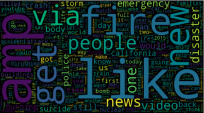

# Twitter_Disaster_Classification
Classify Tweets using various NLP techniques from simple SVC and Logisitic Regression to BERT

Take a look at my notebook [here](https://github.com/ilanazim/Twitter_Disaster_Classification/blob/master/disaster_classification_colab.ipynb)!

## Kaggle Competition: 
[Real or Not? NLP with Disaster Tweets](https://www.kaggle.com/c/nlp-getting-started)

Placed 443 of 2343 - though from what I've read, the first 200 posts of 100% accuracy are bogus...

If anyone has some ideas for how to improve my process (and score!) please pm me! Would love to know how to better fine-tune BERT or combine with an LSTM classifier. 
